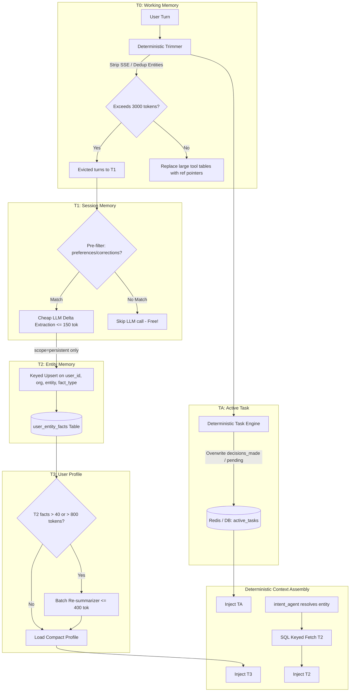

# Implementation Plan — InvestKode Deterministic Memory Compression Architecture

This plan reviews the proposed **Memory Compression Design — InvestKode Memory Manager** against the current codebase (`apps/chat_service`, `apps/ai_orchestrator_service`, and `packages/llm_client.py`), identifies missing technical mechanisms and architectural gaps, and defines the phased implementation strategy.

---

## Codebase Audit & Architectural Reality Check

### Current Implementation vs Proposed Design
| Dimension | Current Codebase (`chat_service` & `ai_orchestrator`) | Proposed 5-Tier Memory Design |
| :--- | :--- | :--- |
| **T0 Working Memory** | Last 30 messages fetched via `_fetch_raw_history`; unbudgeted; tool results discarded after synthesis; no reference pointers. | Last 6–8 raw turns; deterministic trimming; tool payloads replaced with `[ref: ...]` pointers; budget-checked (≤3,000 tokens). |
| **TA Active Task** | **Non-existent**. No tracking of pending work, active filters, or unfinished comparison legs. | Small structured record `(task_id, goal, active_filters, decisions_made, pending)`; updated without LLM calls. |
| **T1 Session Memory** | `_always_update_qa_log` (every turn) + `_maybe_summarize` (every N messages, prose summary + intent classification). | Delta extraction only; triggered on session end/idle/T0 overflow; rule-based pre-filter; structured JSON (≤150 tokens) with mandatory `scope` & `fact_type`. |
| **T2 Entity Memory** | `okf_bundle` JSONB column in `user_summaries` storing path-based concepts (`intents/company_evaluation`, `preferences/...`). No fact-scoped corrections. | Keyed SQL store on `(user_id, organization_id, entity, fact_type)`; update-if-reinforced; supersede-on-contradiction ("sold TCS" touches only ownership). |
| **T3 User Profile** | Incremental prose merge in `update_user_summary` (growing prose text, time/turn triggered). | Batch consolidation triggered strictly by **size threshold** (>40 facts or >800 tokens); cheap LLM caps output to ≤300–400 tokens; recency-weighted pruning. |
| **Retrieval** | Orchestrator loads full `user_summary`, full `okf_bundle`, full `qa_log`, `session_summary`, and 30 messages upfront before intent agent runs. | Always load T3 + TA; **conditionally** load T2 by entity resolved by `intent_agent`; no vector search. |

---

## Critical Gaps & What Was Missing in the Design

### 1. Tool Result Store & Reference Pointer Lifecycle (T0)
* **The Missing Mechanism**: The plan states: *"Replace full tool-call JSON payloads with a short reference... The underlying table stays retrievable by reference, not lost."*
* **The Reality**: In the current codebase, tool execution payloads generated during `run_core_agent` are purely in-memory. When `save_chat_messages_to_service` is called, only the markdown answer and small UI blocks are saved. The raw 15KB table is completely dropped.
* **Solution Required**:
  1. A dedicated `ToolResultStore` backed by Redis (`tool_ref:{chat_id}:{ref_id}` with 7-day TTL) and PostgreSQL (`tool_call_results` table or `message_artifacts`).
  2. When Core Agent finishes tools, heavy tabular outputs (>500 chars) are assigned a reference ID (e.g. `[ref: chat_abc/res_1 — TCS Q3 P&L, 12 rows]`).
  3. A new agent tool: `expand_memory_reference(ref_id: str)` in `core_agent` allowing the agent to deterministically fetch the full table if a follow-up query explicitly asks for it.

### 2. Retrieval Ordering vs Intent Agent Execution (T2)
* **The Missing Mechanism**: In `apps/ai_orchestrator_service/app/api/orchestrator_router.py`:
  - `get_chat_context()` is currently called at line 835 (before intent agent runs).
  - `intent_agent.process_intent()` runs later at line 1013 to resolve entities (`resolved_entities`).
* **The Reality**: T2 retrieval is entity-keyed (`WHERE entity IN (:entities)`). If `get_chat_context()` runs before `intent_agent`, it cannot know which entities to retrieve for T2!
* **Solution Required**:
  - Keep T3 (user profile), TA (active task), and T0 in the initial context fetch.
  - Decouple T2 retrieval: invoke a fast keyed fetch `fetch_entity_facts(user_id, org_id, [e.symbol for e in resolved_entities])` immediately after `intent_agent` resolves entities (or regex entity fallback if intent agent is bypassed).
  - Inject the retrieved T2 facts directly into the system prompt prior to `run_core_agent`.

### 3. TA (Active Task) State Tracking Without an LLM Call
* **The Missing Mechanism**: The design states TA is updated without an LLM call using *"whatever already knows 'what was just done'"*.
* **The Reality**: In `run_core_agent`, the LLM returns unstructured markdown prose as `final_answer`. It does not output a machine-readable task delta.
* **Solution Required**:
  - We have deterministic inputs already available at the end of each turn:
    1. `intent_enrichment` from `intent_agent` (which already extracts `must_cover`, `metrics`, `comparisons`, and `query_type`).
    2. `executed_tools` from `run_core_agent` (e.g., `["get_financial_summary", "get_quarterly_trend"]`).
    3. `resolved_entities` (e.g. `["TCS", "INFY"]`).
  - Implement a deterministic `TaskStateEngine` that computes:
    - `decisions_made`: newly covered entities and metrics from `executed_tools`.
    - `pending`: items from `must_cover` or comparisons not yet covered.
    - If `pending` is empty, auto-retire to `status: completed`.

### 4. Multi-Tenancy & Organization Isolation
* **The Missing Mechanism**: The plan specifies keys as `(user_id, entity, fact_type)`.
* **The Reality**: InvestKode enforces strict tenant boundary rules: memories belong to the user's workspace inside a company and must not leak if the user is in multiple orgs or leaves an org.
* **Solution Required**:
  - All T1, T2, T3, and TA tables and Redis caches must be compound-keyed on `(user_id, organization_id, ...)`.

### 5. Idle Timeout vs Turn-Based Event Triggering (T1)
* **The Missing Mechanism**: In a stateless web app over HTTP/SSE, "session end or 15-minute idle timeout" does not produce an automated event unless an external cron or Redis keyspace event is configured.
* **Solution Required**:
  - Tri-trigger mechanism for T1 delta consolidation:
    1. **Pre-filter on Turn Completion**: Run the regex/keyword pre-filter immediately after each assistant turn. If a match is found (e.g., preference or correction), extract deltas asynchronously in the background.
    2. **T0 Overflow Trigger**: Whenever T0 exceeds the 3,000 token budget, the rolling evicted turn(s) are sent through the T1 delta extractor immediately.
    3. **Idle Sweep / Session Switch**: An opportunistic sweep on session load or via the existing APScheduler in `ai_orchestrator_service`.

### 6. Relational Table Schema for T2 vs Flat OKF JSON
* **The Missing Mechanism**: Current `okf_bundle` is a flat JSON array in `user_summaries`. Keyed lookups and fact-scoped corrections against JSON arrays require full-array rewrites.
* **Solution Required**:
  - Create a dedicated PostgreSQL table `user_entity_facts` in `chat_service`:
    ```sql
    CREATE TABLE IF NOT EXISTS user_entity_facts (
        id VARCHAR PRIMARY KEY,
        user_id VARCHAR NOT NULL,
        organization_id VARCHAR NOT NULL,
        entity VARCHAR NOT NULL,          -- e.g. "TCS", "INFOSYS", or "*" for global preferences
        fact_type VARCHAR NOT NULL,       -- e.g. "ownership", "preference", "interest", "watchlist"
        fact TEXT NOT NULL,
        confidence VARCHAR NOT NULL DEFAULT 'high',  -- "high", "medium", "low"
        scope VARCHAR NOT NULL DEFAULT 'persistent', -- "persistent", "task_only"
        status VARCHAR NOT NULL DEFAULT 'active',    -- "active", "superseded"
        superseded_by VARCHAR,
        created_at TIMESTAMPTZ DEFAULT now(),
        updated_at TIMESTAMPTZ DEFAULT now()
    );
    CREATE UNIQUE INDEX IF NOT EXISTS uq_user_entity_active_fact 
    ON user_entity_facts (user_id, organization_id, entity, fact_type) 
    WHERE status = 'active';
    ```
  - This guarantees O(1) keyed lookups, atomic `ON CONFLICT` updates, and clean superseding for audit trails.

### 7. Token Budgeting & Compaction Utilities
* **The Missing Mechanism**: The plan defines token limits (T0 ≤ 3000, T1 ≤ 150, T3 ≤ 400), but no token calculation method is defined.
* **Solution Required**: Implement a fast deterministic token counter using `tiktoken` (with fallback to `len(text) // 4`) in `packages/` or service utils.

### 8. Strict LLM Gateway & Provider Rules
* **The Rule**: All LLM calls (T1 delta extraction, T3 consolidation) must use `packages/llm_client.py` (`get_service_llm_client(service_id="chat_service", operation=...)`) and route via the LLM Gateway. No raw OpenAI or direct external API keys!

---

## User Review Required

> [!IMPORTANT]
> **Database Table Addition in `chat_service`**:
> We propose introducing two new tables via non-destructive `CREATE TABLE IF NOT EXISTS` in `apps/chat_service/app/prestart.py`:
> 1. `user_entity_facts` (T2 structured entity knowledge base with `(user_id, organization_id, entity, fact_type)` unique constraint).
> 2. `active_tasks` (TA structured active task store).
> In addition, Redis will act as the L1/L2 cache for ultra-fast hot-path retrieval.

> [!NOTE]
> **Model Selection for Memory Consolidation**:
> Per the LLM Gateway architecture, T1 delta extraction and T3 batch consolidation will use gateway-routed lightweight models (e.g. `gpt-5.4-mini` or `deepseek-v4-flash` via `packages/llm_client.py`).

---

## Proposed Implementation Phases



### Phase 1 — Deterministic T0 Trimming & Reference Replacement
- **Component**: `apps/ai_orchestrator_service` & `apps/chat_service`
- Implement `TokenCounter` and rule-based compaction in `apps/ai_orchestrator_service/app/api/orchestrator_router.py`.
- Keep raw recent 6–8 turns. For older turns within session, replace tool result payloads and large markdown tables with `[ref: {chat_id}/{result_id} — {title}, {rows} rows]`.
- Store raw tool payloads in Redis `tool_result:{chat_id}:{result_id}` (7-day TTL).
- Add `expand_memory_reference` tool to `core_agent` allowing deterministic retrieval on follow-up questions.

### Phase 2 — TA Active Task Tracking
- **Component**: `apps/chat_service` & `apps/ai_orchestrator_service`
- Create `ActiveTask` model and table in `chat_service` (with Redis caching `active_task:{chat_id}`).
- Implement `TaskStateEngine` in orchestrator: deterministically merges `intent_enrichment` requirements (`must_cover`, `comparisons`) and `executed_tools` into `decisions_made` and `pending`.
- Clear/archive task state when `pending` is empty or upon idle timeout.

### Phase 3 — T1 Delta Extraction
- **Component**: `apps/chat_service/app/services/`
- Implement lightweight rule-based pre-filter (`is_delta_noteworthy`): checks regex patterns for stated preferences, watchlist instructions, or corrections.
- Implement structured LLM delta extraction in `summarizer.py` using `packages/llm_client.py`:
  - Strict JSON output schema (`facts`, `watchlist_changes`, `corrections`).
  - Mandatory `scope` (`persistent` vs `task_only`) and `fact_type` fields.
  - Strict output token cap (≤150 tokens).

### Phase 4 — T2 Upsert Merge
- **Component**: `apps/chat_service`
- Create `user_entity_facts` table with unique constraint on `(user_id, organization_id, entity, fact_type)` where `status = 'active'`.
- Implement `SummaryRepository.upsert_entity_facts`:
  - Filter out `task_only` facts.
  - Updates existing rows on reinforcement (confidence, `updated_at`).
  - Marks previous row as `status = 'superseded'` if contradictory or corrected (verifying "I sold TCS" updates only `ownership`).

### Phase 5 — T3 Batch Consolidation
- **Component**: `apps/chat_service`
- Add size-threshold check at T1 consolidation time (`active_facts_count > 40` or serialized tokens > 800).
- When triggered, invoke a single cheap LLM batch consolidation call through the gateway, capping output to ≤400 tokens and applying recency-weighted pruning.
- Store the condensed profile in `user_summaries.summary` and cache in Redis.

### Phase 6 — Retrieval Wiring
- **Component**: `apps/ai_orchestrator_service/app/api/orchestrator_router.py`
- Upfront context assembly: load T3 (compact profile) and TA (active task).
- Post-intent context assembly: after `intent_agent` resolves entities (or regex fallback), conditionally execute keyed fetch `fetch_entity_facts(user_id, org_id, [e.symbol for e in entities])` and inject T2 facts into the system prompt.
- Verify multi-entity and open-loop follow-up queries.

### Phase 7 — Telemetry & Verification
- Instrument OpenTelemetry GenAI spans for T1 and T3 LLM calls.
- Track skip rate of T1 pre-filter, T3 profile token plateauing, and reference re-expansion hit rate.

---

## Verification Plan

### Automated Unit & Integration Tests
1. **T0 Trimming & Reference Resolution**:
   - Verify turns older than 8 messages are compacted into `[ref: ...]` pointers.
   - Verify `expand_memory_reference` correctly retrieves the original table from Redis.
2. **TA Open Loop State Transitions**:
   - Simulate a 2-step task ("Compare TCS and Infosys on margin and cash flow").
   - Turn 1: Margin tool runs -> verify `decisions_made` contains margins, `pending` contains cash flow.
   - Turn 2: Follow-up query -> verify TA is injected and resolved correctly.
3. **T1 Pre-filter & Extraction**:
   - Test "What is the PE of Infosys?" -> Verify pre-filter returns False and 0 LLM calls are made.
   - Test "I sold my TCS shares and now prefer concise tables" -> Verify pre-filter returns True, tags `persistent` vs `task_only`, and outputs valid JSON.
4. **T2 Fact-Scoped Correction**:
   - Given existing facts for TCS: `(tracking_interest, high)` and `(ownership, holds 100 shares)`.
   - Process correction: `(ownership, sold TCS)`.
   - Assert `tracking_interest` is untouched, while `ownership` is superseded with the new fact.
5. **T3 Size Threshold Plateau**:
   - Seed 50 synthetic facts. Trigger consolidation.
   - Assert output profile is ≤400 tokens and superseded/low-confidence facts are pruned.

### Manual End-to-End Verification
- Test interactive flow in frontend / SSE:
  1. Open loop task ("Compare TCS and Infosys").
  2. Follow-up resumption ("Now check cash flow").
  3. Reference recall ("What was the exact P/E from that first table?").
  4. Fact correction ("I sold TCS").
