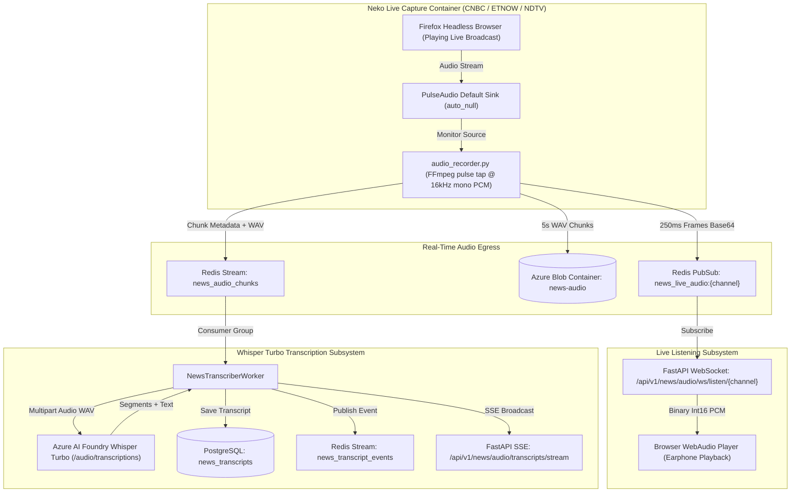

# Walkthrough: Live Listening and Transcribing using Whisper Turbo

We have designed and implemented the **live listening and transcribing** subsystem for [`news_streaming_service`](file:///opt/investcode/apps/news_streaming_service).

The new folder is located at [`apps/news_streaming_service/app/live_listening_and_transcribing/`](file:///opt/investcode/apps/news_streaming_service/app/live_listening_and_transcribing) (with aliases at [`apps/news_streaming_service/live_listening_and_transcribing`](file:///opt/investcode/apps/news_streaming_service/live_listening_and_transcribing) and [`apps/news_streaming_service/live_listening_and_transcribing_using_whisper_turbo`](file:///opt/investcode/apps/news_streaming_service/live_listening_and_transcribing_using_whisper_turbo)).

---

## 1. System Architecture & Data Flow



---

## 2. Key Modules Implemented

### A. Central Configuration
* File: [`apps/news_streaming_service/app/live_listening_and_transcribing/config.py`](file:///opt/investcode/apps/news_streaming_service/app/live_listening_and_transcribing/config.py)
  - Audio standard: 16,000 Hz, 1-channel mono, 16-bit PCM (`s16le`).
  - Redis channels: `news_live_audio:{channel}` (PubSub), `news_audio_chunks` (Stream), `news_transcript_events` (Stream).
  - Azure Blob Container: **`news-audio`** (per user specification).
  - Azure AI Foundry Whisper: Endpoint `https://it-mnymsle7-eastus2.services.ai.azure.com/openai/v1`, Model `whisper-large-v3-turbo`.

### B. Azure Blob Storage Archiver
* File: [`apps/news_streaming_service/app/live_listening_and_transcribing/storage/azure_blob_saver.py`](file:///opt/investcode/apps/news_streaming_service/app/live_listening_and_transcribing/storage/azure_blob_saver.py)
  - Automatically uploads every 5-second broadcast WAV chunk into container **`news-audio`**.
  - Structured path format:
    ```text
    news-audio/{channel}/{YYYY-MM-DD}/{channel}_{timestamp}_{uuid}.wav
    ```

### C. Broadcast Audio Capture
* Files:
  - [`apps/news_streaming_service/app/live_listening_and_transcribing/capture/audio_recorder.py`](file:///opt/investcode/apps/news_streaming_service/app/live_listening_and_transcribing/capture/audio_recorder.py)
  - [`apps/news_streaming_service/app/live-capture/audio_recorder.py`](file:///opt/investcode/apps/news_streaming_service/app/live-capture/audio_recorder.py)
  - [`apps/news_streaming_service/app/live-capture/audio_capture.conf`](file:///opt/investcode/apps/news_streaming_service/app/live-capture/audio_capture.conf)
  - [`apps/news_streaming_service/app/live-capture/run_audio_capture.sh`](file:///opt/investcode/apps/news_streaming_service/app/live-capture/run_audio_capture.sh)
  - [`apps/news_streaming_service/app/live-capture/Dockerfile.neko`](file:///opt/investcode/apps/news_streaming_service/app/live-capture/Dockerfile.neko)
  - Runs inside Neko alongside the screenshot loop via Supervisord.
  - Emits 250ms sub-second chunks to Redis PubSub for lag-free live listening.
  - Converts 5s chunks to standard RIFF/WAV format, uploads to Azure Blob Storage `news-audio`, and emits to Redis Stream `news_audio_chunks`.

### D. Azure Foundry Whisper Turbo Client
* File: [`apps/news_streaming_service/app/live_listening_and_transcribing/transcription/azure_whisper_client.py`](file:///opt/investcode/apps/news_streaming_service/app/live_listening_and_transcribing/transcription/azure_whisper_client.py)
  - Connects to Azure AI Foundry (`/openai/v1/audio/transcriptions`) with Bearer token authentication and automatic fallback to Azure OpenAI deployment endpoints.
  - Injects W3C distributed tracing context.
  - Parses verbose JSON responses with segment timestamps, text, and confidence scores.

### E. Transcription Worker
* File: [`apps/news_streaming_service/app/live_listening_and_transcribing/transcription/transcriber_worker.py`](file:///opt/investcode/apps/news_streaming_service/app/live_listening_and_transcribing/transcription/transcriber_worker.py)
  - Reads queued chunks from `news_audio_chunks` via Redis consumer group `news_whisper_workers`.
  - Dispatches to Azure Foundry Whisper.
  - Saves transcribed news items into the database table `news_transcripts`.
  - Publishes events to Redis Stream `news_transcript_events` and PubSub `news_transcript_feed:{channel}`.

### F. Live Listening & Transcripts API
* File: [`apps/news_streaming_service/app/live_listening_and_transcribing/listening/routes.py`](file:///opt/investcode/apps/news_streaming_service/app/live_listening_and_transcribing/listening/routes.py)
* Mounted in: [`apps/news_streaming_service/app/main.py`](file:///opt/investcode/apps/news_streaming_service/app/main.py)
  - `WebSocket /api/v1/news/audio/ws/listen/{channel}`: Binary WebSocket streaming raw 16kHz Int16 PCM audio directly to browser WebAudio API for live listening.
  - `GET /api/v1/news/audio/transcripts/stream`: Server-Sent Events (SSE) delivering real-time rolling transcripts per channel.
  - `GET /api/v1/news/audio/transcripts`: Historical transcripts with channel filtering, pagination, and keyword search.
  - `GET /api/v1/news/audio/transcripts/{id}`: Detail view including the Azure Blob Storage URL for audio verification.

### G. Database Model
* File: [`apps/news_streaming_service/app/db/models.py`](file:///opt/investcode/apps/news_streaming_service/app/db/models.py)
  - Added `NewsTranscriptItem` mapping to table `news_transcripts` (`id`, `channel`, `timestamp`, `text`, `confidence`, `duration_seconds`, `audio_blob_url`, `created_at`).

---

## 3. Web Client Audio Player Example

Frontend clients can play live audio directly from the WebSocket using the standard WebAudio API:

```javascript
const ws = new WebSocket("wss://api.investkode.com/api/v1/news/audio/ws/listen/CNBC");
ws.binaryType = "arraybuffer";

const audioCtx = new (window.AudioContext || window.webkitAudioContext)({ sampleRate: 16000 });
let nextPlayTime = audioCtx.currentTime;

ws.onmessage = (event) => {
  const pcmInt16 = new Int16Array(event.data);
  const float32 = new Float32Array(pcmInt16.length);
  for (let i = 0; i < pcmInt16.length; i++) {
    float32[i] = pcmInt16[i] / 32768.0;
  }

  const buffer = audioCtx.createBuffer(1, float32.length, 16000);
  buffer.copyToChannel(float32, 0);

  const source = audioCtx.createBufferSource();
  source.buffer = buffer;
  source.connect(audioCtx.destination);

  const now = audioCtx.currentTime;
  if (nextPlayTime < now) nextPlayTime = now;
  source.start(nextPlayTime);
  nextPlayTime += buffer.duration;
};
```
