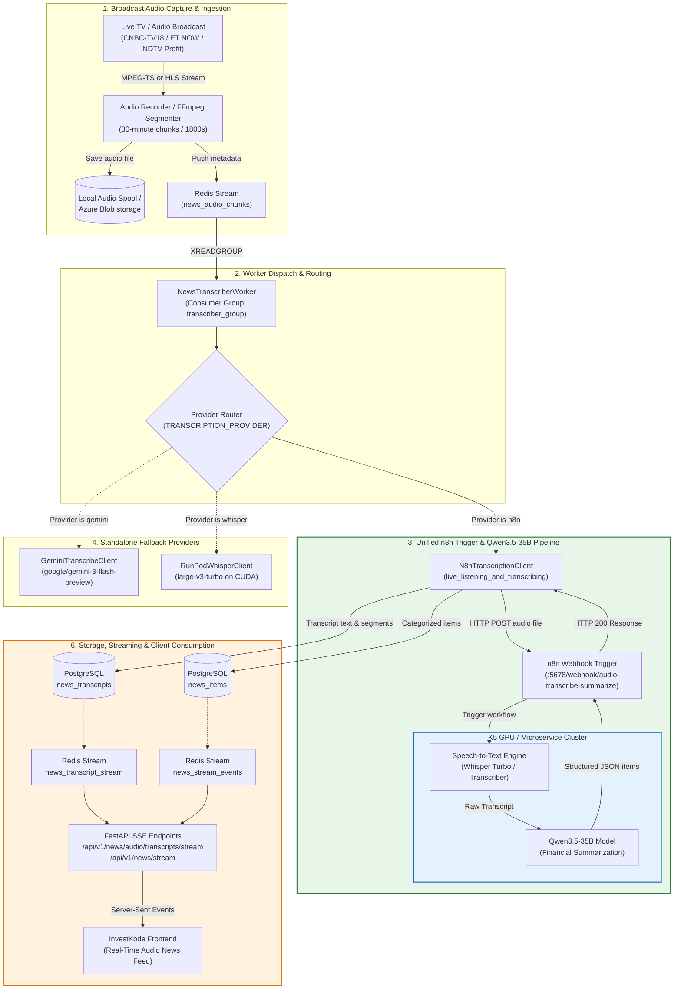
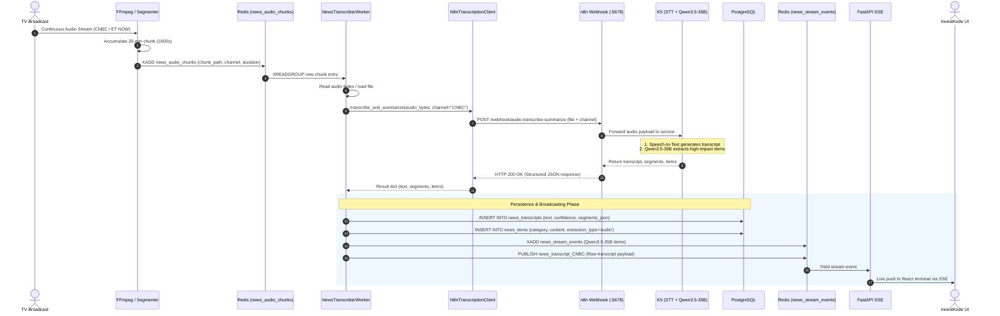

---

## 2. Sequential Runtime Flow Diagram

The following sequence diagram traces the complete lifecycle of a 30-minute audio segment:



---

## 3. Data Contract: What n8n & Qwen3.5-35B Exchange

### Request to n8n Webhook:
* **URL:** `http://20.219.4.10:5678/webhook/audio-transcribe-summarize`
* **Method:** `POST`
* **Headers:** `Authorization: Bearer <N8N_TRIGGER_API_KEY>` (if configured)
* **Form Data / Body:**
  ```json
  {
    "channel": "CNBC",
    "source": "CNBC",
    "audio_blob_url": "https://<account>.blob.core.windows.net/news-audio/...",
    "file": "<multipart audio/mpeg or audio/wav bytes>"
  }
  ```

### Response from n8n & Qwen3.5-35B:
```json
{
  "transcript": "Good morning and welcome to Squawk Box. Tech stocks rallied today...",
  "duration": 1800.0,
  "model": "qwen3.5-35b",
  "segments": [
    {"start": 0.0, "end": 4.2, "text": "Good morning and welcome to Squawk Box."},
    {"start": 4.5, "end": 12.0, "text": "Tech stocks rallied today led by semiconductor earnings."}
  ],
  "items": [
    {
      "category": "company",
      "content": "Nvidia reported record quarterly revenue driven by data center demand."
    },
    {
      "category": "macro",
      "content": "Federal Reserve officials signaled interest rate cuts could begin next quarter."
    },
    {
      "category": "breaking_news",
      "content": "Brent Crude surged past $85/bbl following Middle East supply concerns."
    }
  ]
}
```

---

## 4. Provider Routing Logic

```mermaid
flowchart TD
    START(["Audio Chunk Ready"]) --> CHK{"Check TRANSCRIPTION_PROVIDER"}
    
    CHK -->|Provider is n8n or qwen| N8N_PATH["Invoke N8nTranscriptionClient"]
    CHK -->|Provider is gemini| GEM_PATH["Invoke GeminiTranscribeClient\n(google/gemini-3-flash-preview)"]
    CHK -->|Provider is whisper| RUN_PATH["Invoke RunPodWhisperClient\n(large-v3-turbo GPU)"]
    CHK -->|Provider is azure| AZ_PATH["Invoke AzureSpeechClient"]
    
    N8N_PATH --> N8N_RES["Returns: Transcript + Qwen3.5-35B Items"]
    GEM_PATH --> TXT_ONLY["Returns: Raw Transcript Only"]
    RUN_PATH --> TXT_ONLY
    AZ_PATH --> TXT_ONLY
    
    N8N_RES --> HAS_ITEMS{"Has extracted items"}
    HAS_ITEMS -->|Yes| SAVE_ITEMS["Save directly to news_items\n(No LLM Gateway call needed)"]
    
    TXT_ONLY --> CHK_GW{"ENABLE_LLM_GATEWAY_SUMMARIZATION"}
    CHK_GW -->|false (default)| SKIP_GW["Skip Summarization\n(Save transcript only)"]
    CHK_GW -->|true| CALL_GW["Call LLM Gateway\n(packages/llm_client.py)"]
    
    SAVE_ITEMS --> DISPATCH["Emit to Redis Stream & Push SSE"]
    SKIP_GW --> DISPATCH
    CALL_GW --> DISPATCH
```

---

## 5. Configuration Reference

In [`configs/concall-ui.production.env`](file:///e:/investcodeai/investcode/configs/concall-ui.production.env):

```env
# ── Transcription Provider Selection ─────────────────────────────────────────
# Options: 'n8n' (unified transcription + Qwen3.5-35B), 'gemini', 'whisper', 'azure'
TRANSCRIPTION_PROVIDER=gemini

# ── n8n Trigger & Qwen3.5-35B Service Settings ───────────────────────────────
N8N_TRANSCRIPTION_TRIGGER_URL=http://20.219.4.10:5678/webhook/audio-transcribe-summarize
N8N_TRIGGER_API_KEY=
N8N_TRIGGER_TIMEOUT_SECONDS=180

# ── Direct LLM Gateway Bypass ────────────────────────────────────────────────
# Set to false to disable direct LLM Gateway calls for audio news summarization
ENABLE_LLM_GATEWAY_SUMMARIZATION=false
```
