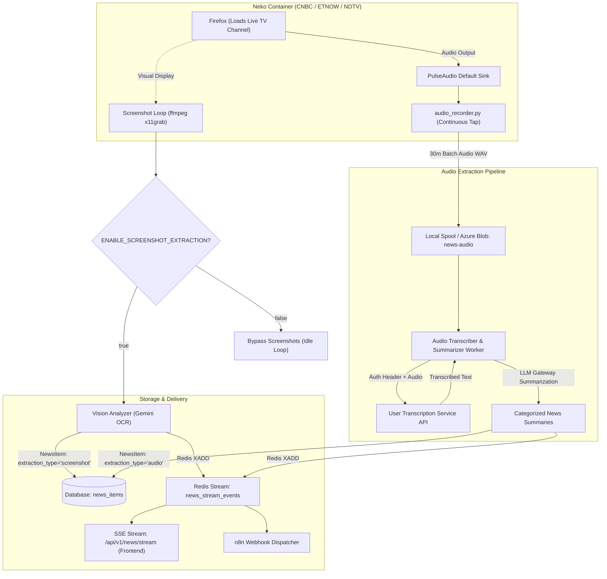

#  News Stream Service Architecture Modifications

This plan outlines the architecture and code modifications for the **`news_streaming_service`** to support:
1. **Screenshot extraction toggle** (`ENABLE_SCREENSHOT_EXTRACTION=true|false`).
2. **Audio-based news extraction & summarization** with real-time SSE push events to the frontend.
3. **Orchestration analysis with n8n** (how n8n can orchestrate transcription, summarization, and distribution).
4. **Database schema modification** (adding `extraction_type = "audio" | "screenshot"` to `NewsItem`).
5. **Transcription service API integration hook** (modular authenticated client for the user's API).

---

## User Review Required

> [!IMPORTANT]
> **1. Neko Browser Lifecycle when Screenshot Extraction is Disabled**:
> When `ENABLE_SCREENSHOT_EXTRACTION=false`, Firefox **must still run and navigate to the live TV channel** because PulseAudio captures sound directly from the browser window.
> The toggle bypasses the `ffmpeg -f x11grab` screenshot capturing and `upload_blob.py` loop, keeping the browser active in an idle loop. This saves substantial CPU, disk, and vision LLM costs while keeping audio capture active.

> [!IMPORTANT]
> **2. n8n Orchestration Architecture Decision**:
> We recommend a **Dual-Mode Orchestration** design:
> - **Direct Microservice Pipeline**: `news_streaming_service` can call the user's transcription API directly, summarize via LLM Gateway, save to DB (`extraction_type="audio"`), and push to frontend via Redis Stream `news_stream_events` (instant SSE).
> - **n8n Ingest & Orchestration Endpoint**: We provide an ingest endpoint `POST /api/v1/news/items` and emit events to `N8N_WEBHOOK_URL`. If you prefer n8n to handle the summarization and routing, n8n can receive the raw transcript/audio URL, run its AI nodes, and POST structured items back into the service.

---

## Proposed Changes

---
